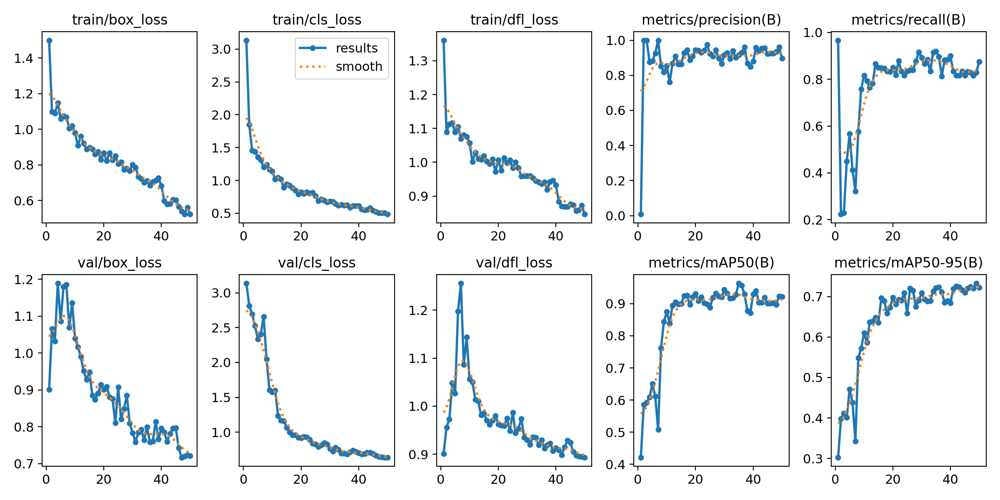
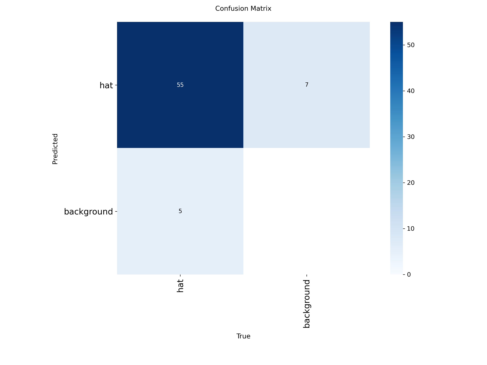

# 🦺 AI-Based Worker Safety Monitoring Using YOLO11


## 📌 Project Overview

This project presents an **AI-Based Worker Safety Monitoring System** using the **YOLO11 object detection model**. The system automatically detects whether workers are wearing safety helmets in images or video streams.

The objective is to improve workplace safety by providing real-time helmet detection in industrial environments such as construction sites, factories, and manufacturing plants.

---

## 🎯 Objectives

- Detect workers wearing helmets.
- Detect workers without helmets.
- Improve workplace safety through AI-based monitoring.
- Reduce manual safety inspections.
- Enable real-time detection using YOLO11.

---

## 🚀 Features

- ✅ Real-time helmet detection
- ✅ Image detection
- ✅ High detection accuracy
- ✅ YOLO11-based object detection
- ✅ Fast inference speed
- ✅ Easy deployment
- ✅ Industrial safety monitoring

---

## 🛠️ Technologies Used

| Technology | Purpose |
|------------|---------|
| Python | Programming Language |
| YOLO11 | Object Detection |
| OpenCV | Image Processing |
| Ultralytics | YOLO Framework |
| Jupyter Notebook | Development |
| NumPy | Numerical Computing |
| Matplotlib | Visualization |

---

## 📂 Project Structure

```
AI-Based-Worker-Safety-Monitoring-Using-YOLO11/

│
├── Ai_based_safety_monitoring.ipynb
├── best.pt
├── yolov11_config.yaml
├── test-imgs/
├── train-18/
└── README.md
```

---

## 📊 Model Performance

| Metric | Value |
|---------|--------|
| Precision | 96.13% |
| Recall | 95% |
| mAP@50 | 96% |
| Framework | YOLO11 |

> *Performance may vary depending on the dataset and hardware configuration.*

---

## 📷 Sample Results

### Helmet Detection



### Confusion Matrix



---

## 💻 Installation

Clone the repository

```bash
git clone https://github.com/rudra5090/AI-Based-Worker-Safety-Monitoring-Using-YOLO11.git
```

Move to project folder

```bash
cd AI-Based-Worker-Safety-Monitoring-Using-YOLO11
```

Install dependencies

```bash
pip install ultralytics
pip install opencv-python
pip install matplotlib
pip install numpy
```

---

## ▶️ Run the Project

Open Jupyter Notebook

```bash
jupyter notebook
```

Open

```
Ai_based_safety_monitoring.ipynb
```

Run all cells.

---

## 📈 Training

The model was trained using the Ultralytics YOLO11 framework.

Example training command

```python
from ultralytics import YOLO

model = YOLO("yolo11n.pt")

model.train(
    data="yolov11_config.yaml",
    epochs=50,
    imgsz=640
)
```

---

## 🔍 Prediction

```python
from ultralytics import YOLO

model = YOLO("best.pt")

results = model.predict(
    source="test-imgs",
    conf=0.25,
    save=True
)
```

---

## 🌟 Applications

- Construction Sites
- Manufacturing Industries
- Smart Factories
- Mining Industries
- Warehouse Safety
- Industrial Monitoring
- PPE Compliance Monitoring

---

## 📌 Future Improvements

- Detect multiple PPE items
- Helmet + Safety Vest Detection
- Live CCTV Monitoring
- Person Tracking
- Mobile Application
- Cloud Deployment
- Alert Notification System

---

## 👨‍💻 Author

**Rudranarayan Debata**

Computer Science Engineering Student

GitHub: https://github.com/rudra5090

---

## ⭐ Support

If you like this project, please ⭐ Star this repository.

It helps others discover the project and motivates further development.

---

## 📜 License

This project is licensed under the MIT License.
